# Security groups
## instances
Create a security group for the instances.  
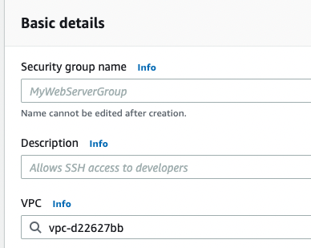  
Name terraform-example-paul.  
Enter a description: Allow http on port 8080 to instances  

Add an inbound rule:  
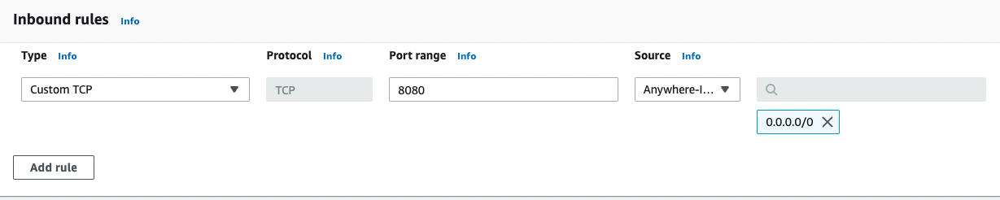  
  Type: Custom TCP  
  Port Range 8080  
  Source: 0.0.0.0/0  

Delete the outbound rule  

Click create security group  

## load balancer
Create a security group for the load balancer.  
  
Name terraform-alb-paul.  
Enter a description: allow http inbound and health checks outbound  
  
Add an inbound rule: 
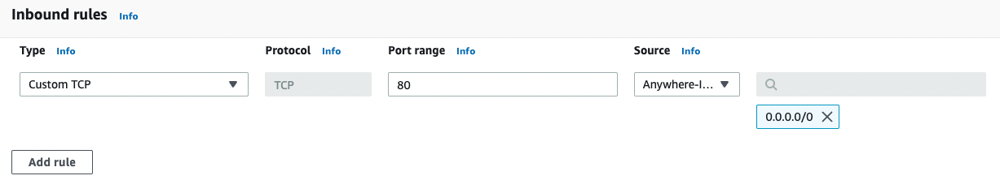   
  Type: HTTP  
  Source: 0.0.0.0/0  


# Launch configuration for instances
Go to Launch configurations and click Create launch configuration  
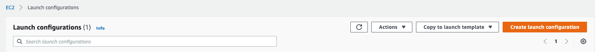  

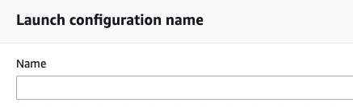  
Name: launchconfig-paul  

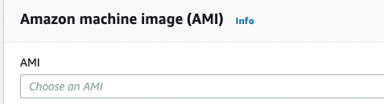  
Select the AMI, find and select ami-0c6ebbd55ab05f070  

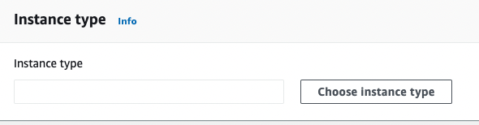  
Choose instance type, find and select t2.micro from the list   

Expand Additional Configuration  
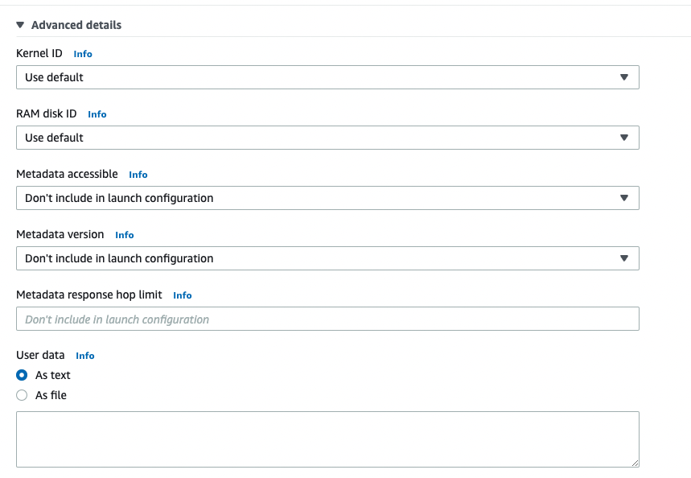  
In the user data box enter:
```
  #!/bin/bash
  echo "Hello, World!" > index.html
  nohup busybox httpd -f -p 8080 &
```

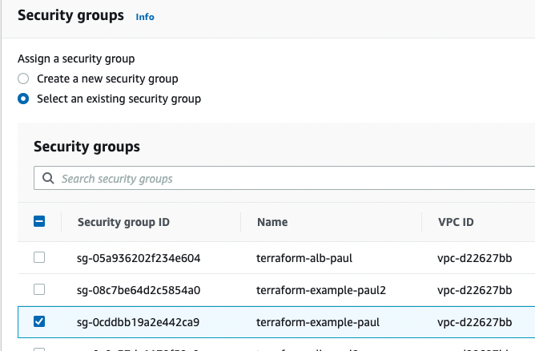  
Select the existing security group: terraform-example-paul

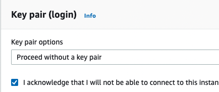  
Select Proceed without key-pair and select acknowledge.  

Click Create launch configuration  

# Loadbalancer
## Target groups
Go to Target Groups and click Create Target Group  
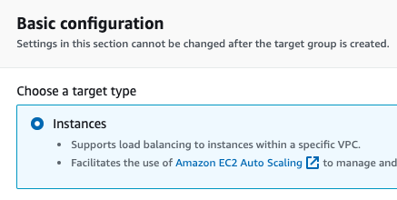  
Select target type: instances

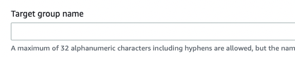  
Target group name: terraform-asg-paul  

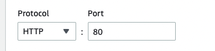  
Change the port to 8080  

Expand advanced health check settings  
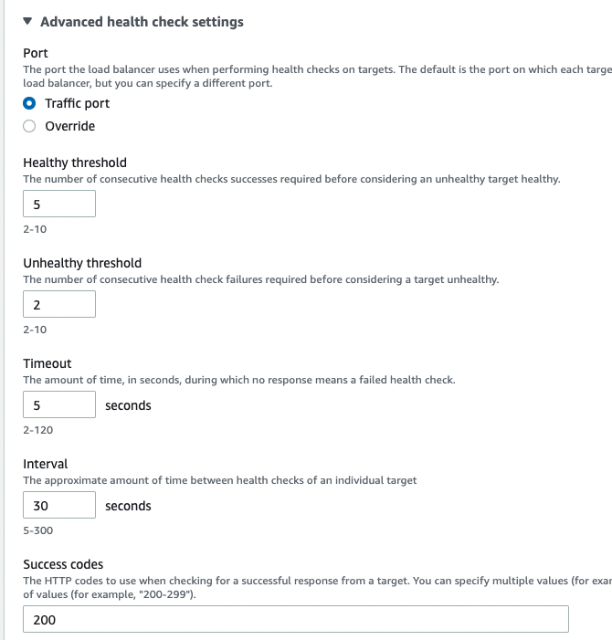  
Set healthy threshold to 2  
Set Timeout to 3  
Set Interval to 15  

Click next  
Click Create Target Group  


## load balancer
Go to Load balancers and click create Load Balancer  
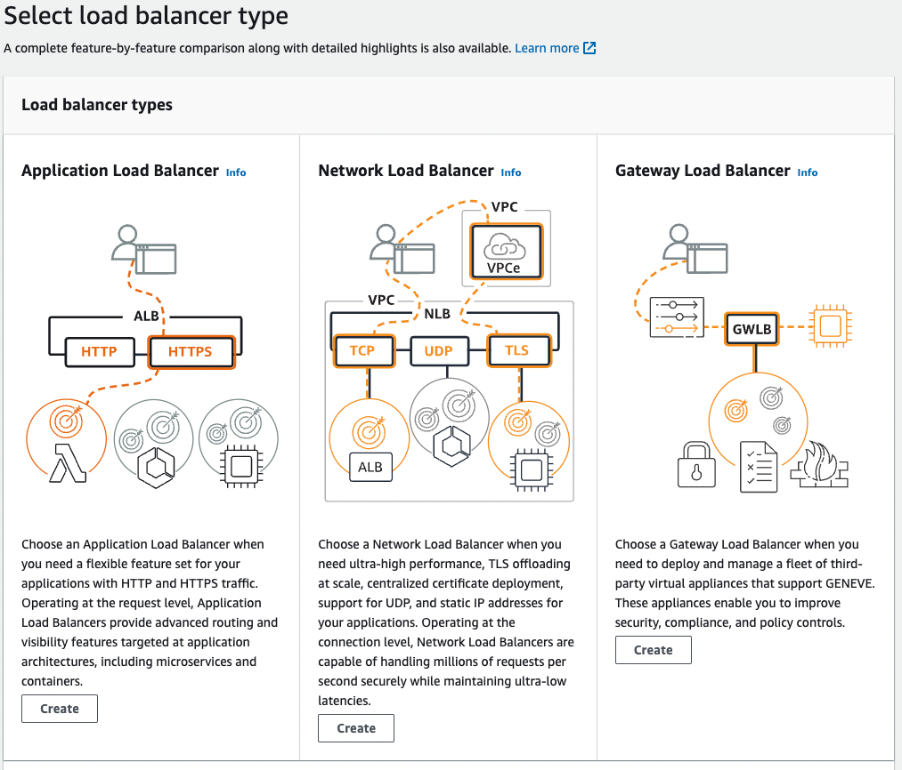  
Click create under the desired load balancer, here Application Load Balancer.  

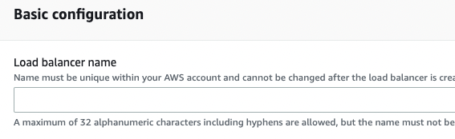  
Name: terraform-asg-paul  

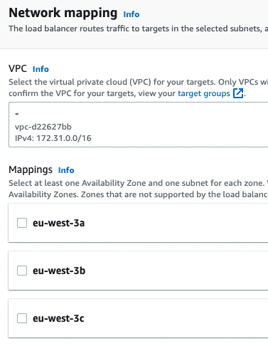  
Select all three availability zones.  

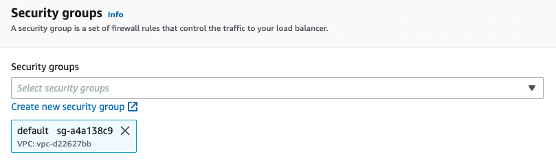  
Select the security group terraform-alb-paul  
Remove the default security group  

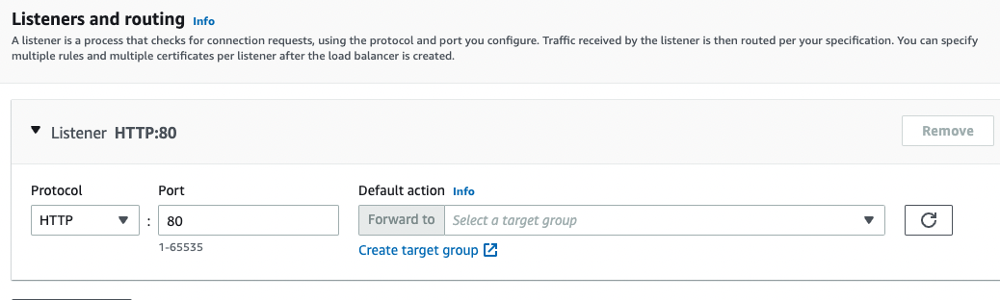  
Select the target group terraform-asg-paul  

Edit the listener  
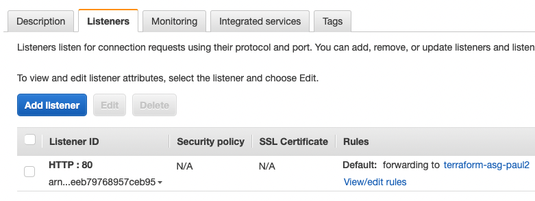  

Remove the default action of Forward to  
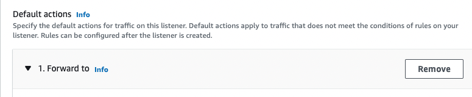

Select the action: Fixed Response  
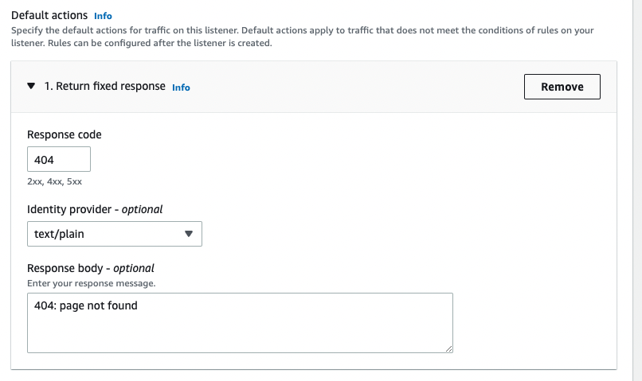  
Set response code to 404  
Set Response Body to: 404: page not found  

Click Save Changes  

Now click on view/edit rules  

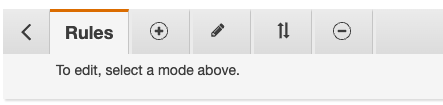  
Click the +  

  
Click + Insert Rule  

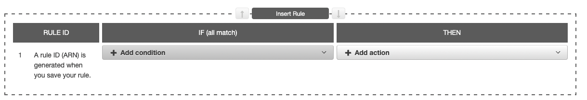  
Click add condition and select Path  
Enter the value : *  
Click the blue check mark  

Click Add Action and select Forward to  
Select the target group, terraform-asg-paul  
Click the blue check mark  

Click Save  


# Auto Scaling Group
Go to Auto Scaling Groups and click Create Auto Scaling Group  
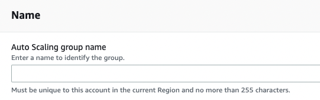  
Name:  asg-paul

  
Click Switch to Launch Configuration  

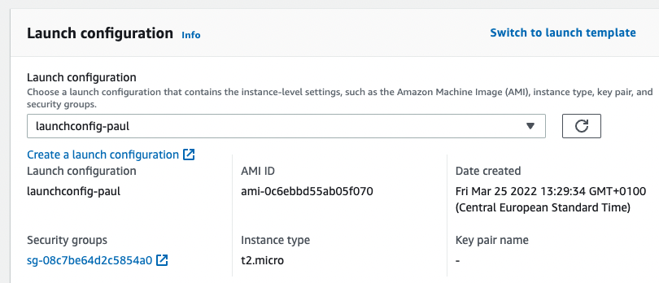  
Select the desired launch configuration, launchconfig-paul  

Click next  

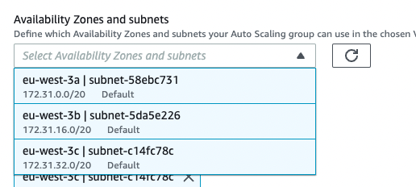  
Select al three Availability Zones  

Click Next  

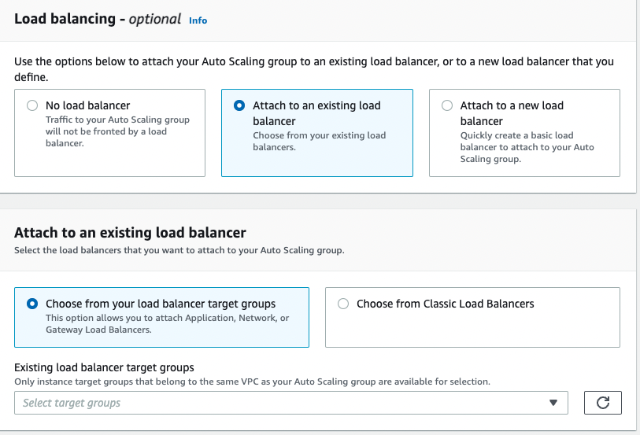  
Select Attach to an existing load balancer  
Select target group terraform-asg-paul under Existing load balancer target groups  


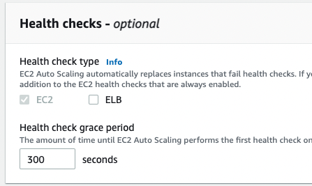  
Select ELB 

Click Next  

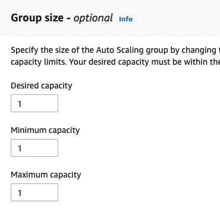  
Set Desired capacity to 2  
Set Minimum capacity to 2  
Set Maximum capacity to 4  

Click Next  

Click Next  

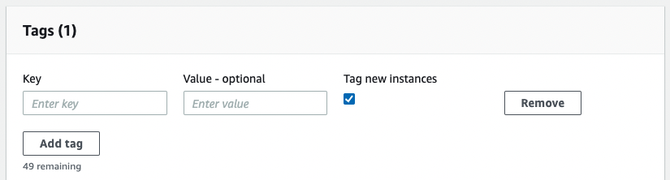  
Add a tag with Key: Name  
and Value: terraform-asg-paul  

Click Next  

Click Create Auto Scaling Group  


## schedule
Go to automatic scaling and click Create scheduled action  

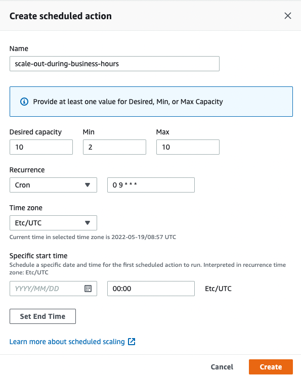  
Click create  