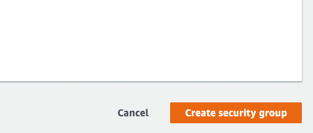
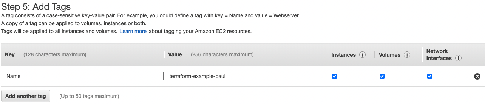

# Security group
In the console go to Security Groups  

Click Create security group  


Fill out a name.  
Manually you need the add a description, if created by terraform a default description is added (Managed by Terraform).  
Select the VPC you want the security group attached to, here it's the default.  


Under Inbound rules, click Add rule  


Create rule as above  


Click Create security group  

# EC2 instance
In the console go to EC2  


Click Launch Instances  


Select the AMI you want to run, here ami-0c6ebbd55ab05f070.  


Select your instance type, here t2.micro.  


Click 'Next: Configure Instance Details'  

On the next screen you can edit VPC and subnets etc, for now the defaults are fine.  

Under advanced details  

Enter the user_data in the box
```
  #!/bin/bash
  echo "Hello, World!" > index.html
  nohup busybox httpd -f -p 8080 &
```
Note: user-data is default only run at first boot.
If you want it to run every boot, follow [this doc](https://aws.amazon.com/premiumsupport/knowledge-center/execute-user-data-ec2/)  

Click Next: Add storage  
For now, nothing to do  
Click Next: Add Tags  


Click Add Tag  
Give it a Key (Name) and a Value (terraform-example-paul)  

Click Next: Configure Security Group  


Because the security group is already created, select an existing security group  
Select the security group you want associated with the instance, here the one with the name terraform-example-paul.  


Click Review and Launch  


For now, ignore this warning, if necessary, add the port to the security group.
Click continue.  

Review the instance details.  
Click Launch.  


For now, select Proceed without a key pair and check Acknowledge.  
Click Launch Instances  
