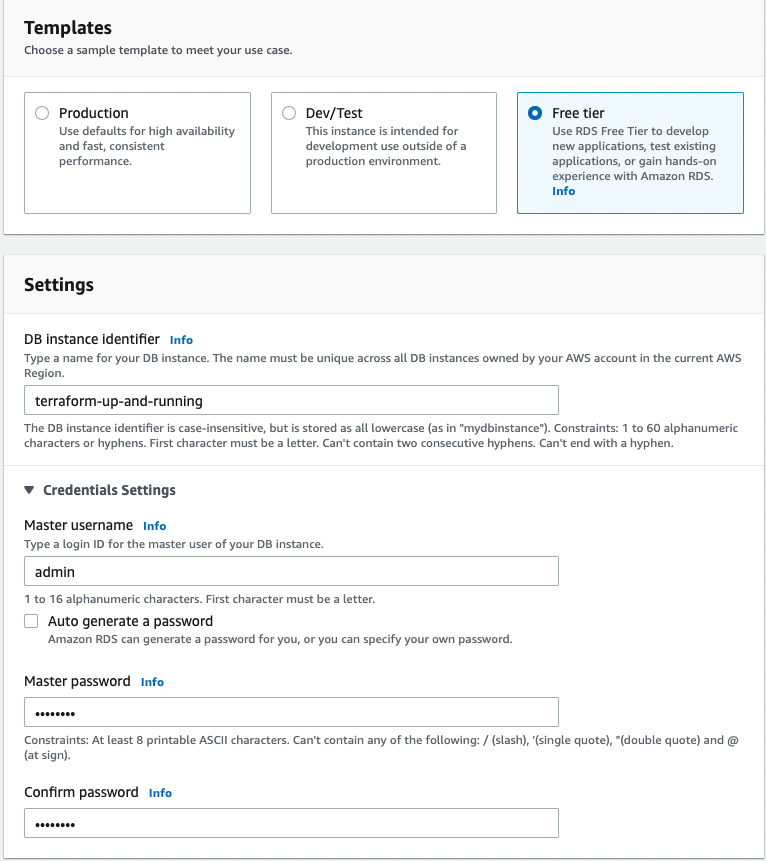

10GB instead of 20GB, gui however says 20GB minimum.
But after trying again with 10GB it works.  

Click create database.  

Copy tags to snapshots Disabled by terraform, in gui no option available.  
After creation, modify the instance  

Uncheck Copy tags to snapshots.